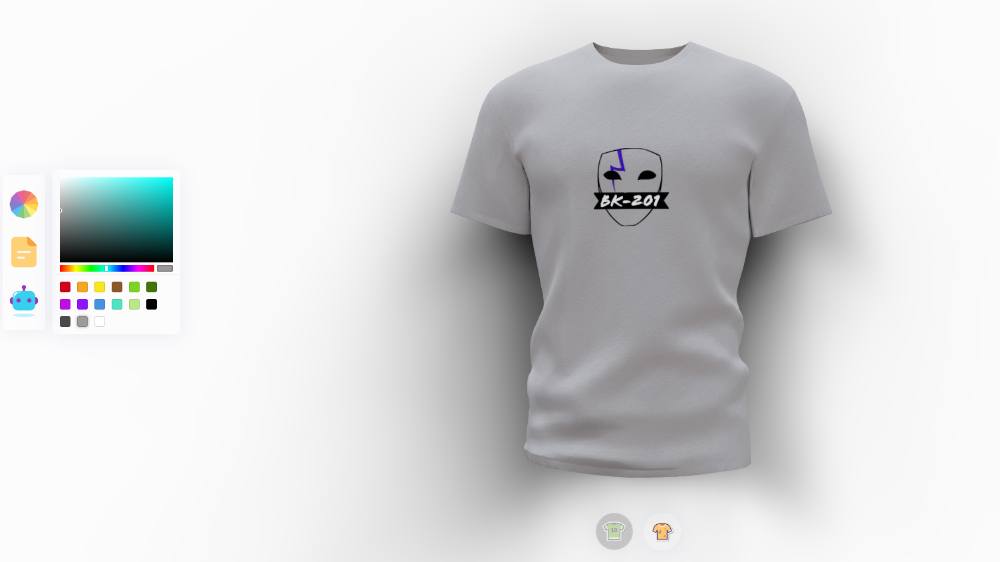

# threeJS-3D-TShirt
Web application with which you can choose a logo and color for a T-shirt and view it in 3D format.

Functionality: 
<ul><li>Color selection.</li>
<li>Upload your image and choose it as a small logo or fill the entire t-shirt.</li>
<li>It is also possible to generate an image using artificial intelligence (openai) and select this image as a logo or color. <i>Right now this feature is currently not available due to country restrictions :(</i> </li>
</ul>

